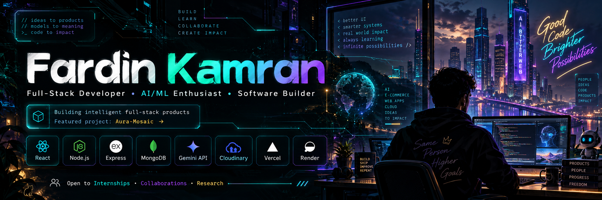

  

<h1 align="center">⚡ Hey, I'm Fardin Kamran</h1>

<h3 align="center">Full-Stack Developer · AI/ML Enthusiast · Software Builder</h3>

  

  
  
  

  

---

## `> ABOUT_ME.exe`

I'm a **Computer Science & Engineering student at BRAC University** who enjoys building software where **engineering, product thinking, and intelligent systems** meet.

- 💻 I build **full-stack products** from interface to database and deployment.
- 🤖 I enjoy adding **AI/ML features that solve real product problems**.
- ⚙️ I work with **APIs, authentication, databases, cloud deployment, and software architecture**.
- 🌐 I'm especially interested in **real-time systems, intelligent web apps, and polished product experiences**.
- 🧠 My favorite learning loop is simple: **build → break → understand → improve → ship**.
- 🚀 I'm open to **internships, collaborations, and research opportunities**.

### `SYSTEM PROFILE`

| ⚡ Signal | Status |
|---|---|
| **Role** | Full-Stack Developer |
| **Focus** | AI/ML · Software Engineering · Real-Time Systems |
| **Mindset** | Build → Learn → Improve → Ship |
| **Open To** | Internships · Collaborations · Research |

---

## `> TECH_STACK.sys`

  

| Domain | Tools & Technologies |
| --- | --- |
| **Frontend** | React · Next.js · TypeScript · JavaScript · Tailwind CSS · Vite |
| **Backend** | Node.js · Express.js · REST APIs · Authentication |
| **Databases** | MongoDB · MySQL |
| **AI / ML** | Python · PyTorch · Gemini-powered application features |
| **Engineering** | Git · GitHub · Docker · Vercel · Render · Software Architecture |
| **Exploring** | WebRTC · Real-time systems · Intelligent product experiences |

---

## `> FEATURED_PROJECT.launch()`

<h2 align="center">🛍️ Aura-Mosaic</h2>

  <b>AI-powered e-commerce for kids and women — built around intelligent product discovery.</b>

**Aura-Mosaic** is a full-stack AI-powered e-commerce platform combining a playful, modern shopping experience with intelligent product discovery.

The platform includes **secure authentication, product and category management, wishlist and cart functionality, COD checkout, customer profiles, order tracking, reviews, admin analytics, inventory management, and Cloudinary-based image uploads**.

Its AI layer is powered by **Google Gemini** and includes:

- ✨ **AI Shopping Studio** — helps users discover relevant products.
- 🎁 **AI Gift Studio** — recommends gifts based on user context.
- 💬 **Conversational Shopping Assistant** — recommends only real products from the live MongoDB catalogue.
- 🛡️ **Role-based admin access** — separates customer and administrative workflows.
- 📱 **Responsive dual-theme UI** — designed for polished use across screen sizes.
- ☁️ **Production deployment** — frontend on Vercel and backend on Render.

  
  
  
  
  
  
  
  

  
  &nbsp;
  

---

## `> GITHUB_SIGNALS.scan()`

  
  
  

  

---

## `> SNAKE_PROTOCOL.run()`

  <picture>
    <source
      media="(prefers-color-scheme: dark)"
      srcset="https://raw.githubusercontent.com/Fardin1023/Fardin1023/output/github-contribution-grid-snake-dark.svg"
    />
    <source
      media="(prefers-color-scheme: light)"
      srcset="https://raw.githubusercontent.com/Fardin1023/Fardin1023/output/github-contribution-grid-snake.svg"
    />
    
  </picture>

  Every square is another iteration in the build → learn → improve loop.

---

## `> CURRENT_STATUS.log`

| Status | Current Direction |
|---|---|
| 🟢 **Building** | Full-stack products |
| 🧠 **Exploring** | AI/ML and intelligent software systems |
| ⚙️ **Improving** | Software architecture and backend design |
| ⚡ **Experimenting** | Real-time technologies |
| 🚀 **Open To** | Internships · Collaborations · Research |

---

<h3 align="center">⚡ Build. Learn. Improve. Repeat.</h3>

  I like working at the intersection of 
  <b>good engineering · useful products · intelligent software</b>

  

  <code>while (curious) → learn() → build() → improve() → ship()</code>

  Thanks for visiting — explore the repositories, break things, build better things. ⚡

